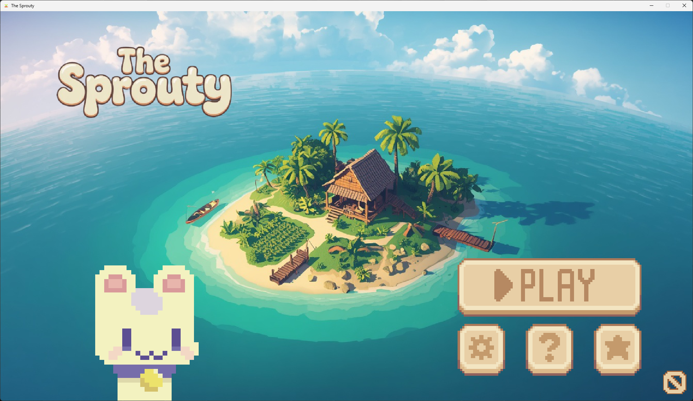
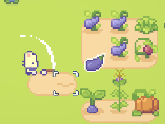
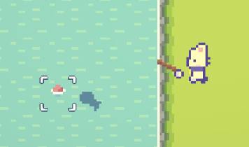
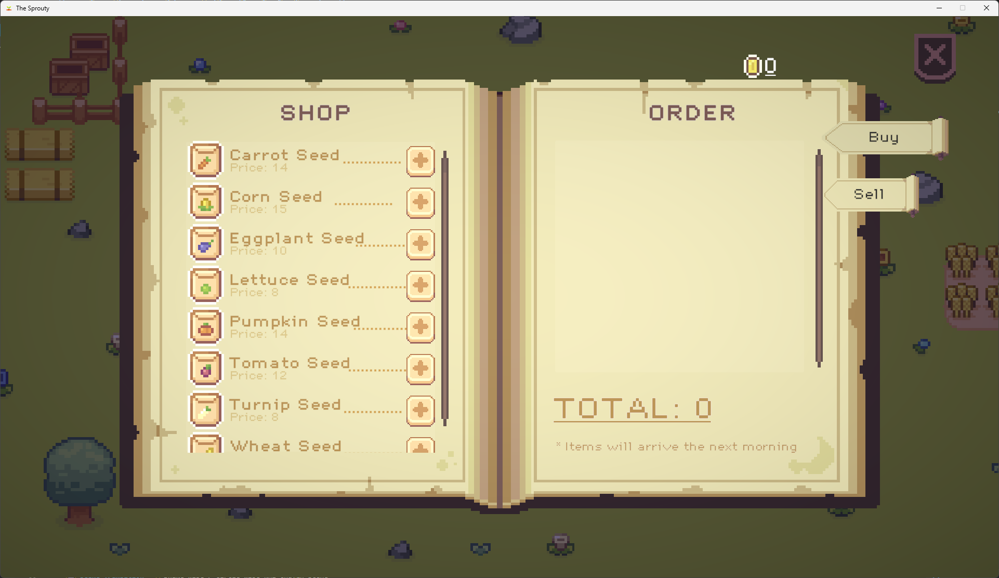

# 🌱 The Sprouty

> **Game nông trại 2D phong cách Cozy — phát triển trên nền tảng Unity 6**

[](https://unity.com/)
[](https://learn.microsoft.com/dotnet/csharp/)
[](https://docs.unity3d.com/Packages/com.unity.render-pipelines.universal@17.3/)
[]()

---

## 📖 Mô tả

**The Sprouty** là một tựa game **2D Cozy Farming Simulation** với góc nhìn từ trên xuống (top-down). Người chơi vào vai một nông dân trẻ vừa đặt chân lên một hòn đảo nhỏ yên bình, từng bước xây dựng nông trại của riêng mình thông qua các hoạt động cày đất, gieo hạt, tưới cây, thu hoạch, chăn nuôi, đánh bắt và buôn bán.

Game theo triết lý sandbox **không áp lực — không "game over"**, hướng đến trải nghiệm thư giãn (relaxing) và sự lặp lại có ý nghĩa của các hoạt động hằng ngày.

**Lấy cảm hứng từ:** Sprout Valley, Stardew Valley.

---

## 🎮 Screenshots

|            |  |
| :------------------------------------------------: | :------------------------------------------------: |
|                Màn hình Menu chính                 |                 Gameplay nông trại                 |
|  |       |
|                                                    |
|                  Hoạt động câu cá                  |                  NPC Clove & Shop                  |

---

## ✨ Tính năng chính (13 hệ thống)

### Gameplay cốt lõi

- **🚶 Player System** — di chuyển 8 hướng, Rigidbody2D, blend tree animation, dispatch hành động theo công cụ
- **🪨 Resource Gathering** — chặt cây (TimberTree), đập đá (Pebble/Boulder), hái quả (FruitTree) với Template Method pattern
- **🌾 Farming System** — chu trình cày → tưới → gieo → sinh trưởng → thu hoạch; state machine `GrassDirt → Dirt → TilledDirt → HasCrop`
- **🎣 Fishing System** — 36 loài cá phân theo 4 mức độ hiếm (Common / Uncommon / Rare / Legendary), weighted spawn

### NPC & AI

- **🐔 Chicken NPC** — 12 trạng thái FSM (Idle, Wander, WalkToNest, SleepInNest, LayDownGrass, Flee, Incubating, …)
- **🐄 Cow NPC** — 7 trạng thái FSM (Idle, Wander, LayDown, SitIdle, Sleep, GetUp, Happy)
- **🗣️ NPC Shop (Clove)** — dialogue typewriter, mở Shop Panel với 2 trang Buy/Sell

### Hệ thống nền tảng

- **⏰ Day / Night Cycle** — vòng quay thời gian theo `realSecondsPerGameDay`, Light 2D gradient, ngủ chuyển ngày
- **🎒 Inventory** — drag-and-drop, stack, 2-tier wheel (Tool + Seed) với fly-out animation
- **💾 Save / Load** — JSON multi-slot (5 slot), auto-save khi ngủ, lưu đầy đủ time/player/inventory/farm/NPCs/world items/gold
- **💰 Economy / Shop** — vàng, mua/bán qua đêm với resolve order `Sell → Buy`
- **🔊 Audio System** — BGM fade, SFX, ambience (BirdAmbience theo giờ), multiplier system với PlayerPrefs
- **🎬 Scene Transition** — Snake-wipe / Circle-wipe khi chuyển scene

### UI / UX

- Menu chính với 5 save slot
- Settings: volume (Music/SFX/Ambience), fullscreen, target FPS
- Pause Manager (ESC)
- Notification stacking, Saving indicator

---

## 🛠️ Công nghệ sử dụng

| Công nghệ             | Phiên bản         | Vai trò               |
| --------------------- | ----------------- | --------------------- |
| **Unity**             | 6000.x (Unity 6)  | Game engine           |
| **C#**                | .NET Standard 2.1 | Ngôn ngữ chính        |
| **URP 2D Renderer**   | 17.3.0            | Render pipeline       |
| **Input System**      | 1.19.0            | Quản lý đầu vào       |
| **Cinemachine**       | 3.1.6             | Camera follow         |
| **NavMeshPlus**       | h8man/NavMeshPlus | NavMesh 2D cho NPC AI |
| **Tilemap + Extras**  | Bundled           | Vẽ map                |
| **2D Animation**      | Bundled           | Animation nhân vật    |
| **Aseprite Importer** | Bundled           | Import file .aseprite |
| **TextMesh Pro**      | Bundled           | Render text           |

---

## 🚀 Hướng dẫn cài đặt

### Yêu cầu hệ thống

- **Unity 6 (6000.x)** trở lên — [Download tại đây](https://unity.com/download)
- **Git** đã cài trên máy — [Download git](https://git-scm.com/downloads) (cần để Unity tự fetch NavMeshPlus package)
- **Kết nối internet** lần đầu mở project (để Unity Package Manager download dependencies)
- Windows 10/11 hoặc macOS / Linux
- Tối thiểu 4 GB RAM trống, ~1.5 GB dung lượng ổ đĩa

### Clone & mở project

```bash
# Clone repository
git clone https://github.com/nguyendinhthach/thesprouty.git
cd thesprouty

# Mở bằng Unity Hub
# 1. Mở Unity Hub
# 2. Add project → chọn thư mục thesprouty
# 3. Đảm bảo phiên bản Unity 6 (6000.x) được cài đặt
# 4. Mở project — Unity sẽ tự import assets (mất 5-15 phút lần đầu)
```

### Chạy game

1. Trong Unity Editor, mở scene `Assets/Scenes/MenuScene.unity`
2. Nhấn nút **Play** (▶) ở thanh trên cùng
3. Chọn 1 save slot để bắt đầu

### Build standalone

1. `File → Build Settings`
2. Chọn **Platform: Windows / Mac / Linux**
3. Thêm 2 scene vào build:
   - `Assets/Scenes/MenuScene.unity` (index 0)
   - `Assets/Scenes/MainScene.unity` (index 1)
4. Nhấn **Build** → chọn folder lưu

---

## 🎮 Cách chơi (Controls)

| Phím                  | Hành động                          |
| --------------------- | ---------------------------------- |
| **W A S D** / Mũi tên | Di chuyển nhân vật                 |
| **Chuột trái**        | Sử dụng công cụ đang cầm           |
| **Chuột phải**        | Hủy hành động (vd: hủy câu cá)     |
| **TAB**               | Mở/đóng Bánh xe công cụ            |
| **I**                 | Mở/đóng Inventory                  |
| **B**                 | Nói chuyện với NPC (khi trong tầm) |
| **ESC**               | Mở Pause Menu                      |

### Vòng lặp gameplay cơ bản

1. **Sáng** — ra ngoài, cày đất, tưới cây, kiểm tra vật nuôi
2. **Giữa ngày** — chặt cây, đập đá, câu cá, khám phá
3. **Chiều** — bán hàng cho NPC Clove, đặt mua hạt giống mới
4. **Tối** — về nhà, vào giường ngủ → ngày mới bắt đầu (giao dịch qua đêm được giải quyết)

---

## 📁 Cấu trúc thư mục

```
TheSprouty/
├── Assets/
│   ├── Scripts/              # 144 file C# (Player, Farming, NPC, Fishing, Save…)
│   │   ├── Audio/
│   │   ├── Economy/
│   │   ├── Environment/
│   │   ├── Farming/
│   │   ├── Fishing/
│   │   ├── Interfaces/
│   │   ├── Items/
│   │   ├── NPC/{Base, Chicken, Cow}/
│   │   ├── Player/
│   │   ├── Save/
│   │   ├── Time/
│   │   └── UI/
│   ├── ScriptableObjects/    # 100+ asset cấu hình
│   ├── Scenes/               # MenuScene, MainScene
│   ├── Sprites/              # Sprite nhân vật, NPC, item
│   ├── Animations/           # Animation clips
│   ├── Prefabs/              # Prefab các đối tượng game
│   ├── Tilemaps/             # Tile assets
│   ├── Audio/                # BGM, SFX, ambience
│   └── _SproutLandsAssets/   # Asset bên thứ ba
├── ProjectSettings/
└── README.md
```

---

## 👥 Thành viên nhóm

| MSSV        | Họ tên                     | Vai trò               | Phụ trách chính                                                             |
| ----------- | -------------------------- | --------------------- | --------------------------------------------------------------------------- |
| **2314506** | **Nguyễn Đình Thạch**      | Team Lead / Developer | Player, Farming, NPC AI (Chicken + Cow FSM), Inventory & UI, Map & Scene    |
| **2312729** | **Nguyễn Văn Quốc**        | Developer             | Resource & Environment, Data/SO, Interfaces, UI/UX & Audio (Menu, BGM, SFX) |
| **2312718** | **Phạm Nguyễn Ngọc Phước** | Developer             | Fishing System (36 cá), Save/Load (multi-slot JSON), Time & Lighting        |

**Đồng phụ trách (cả nhóm):** Settings/Pause Manager · Economy/Shop System

---

## 📚 Tài liệu tham khảo

### Tài liệu kỹ thuật

- [Unity 6 Manual](https://docs.unity3d.com/6000.0/Documentation/Manual/)
- [Unity Scripting API](https://docs.unity3d.com/6000.0/Documentation/ScriptReference/)
- [Input System Package](https://docs.unity3d.com/Packages/com.unity.inputsystem@1.19/)
- [URP 2D Renderer](https://docs.unity3d.com/Packages/com.unity.render-pipelines.universal@17.3/)

### Design Patterns

- Gamma, Helm, Johnson, Vlissides — _Design Patterns: Elements of Reusable Object-Oriented Software_ (1994)
- Robert Nystrom — [Game Programming Patterns](https://gameprogrammingpatterns.com/)

### Thư viện bên thứ ba

- [NavMeshPlus by h8man](https://github.com/h8man/NavMeshPlus) — NavMesh 2D plugin

### Cảm hứng thiết kế

- [Sprout Valley](https://store.steampowered.com/app/1964820/Sprout_Valley/) by Vadzim Liakhovich / RedDeer.Games
- [Stardew Valley](https://www.stardewvalley.net/) by ConcernedApe
- [Rapid Vectors — 2D Farming Game Tutorial (YouTube, 25 episodes)](https://www.youtube.com/watch?v=it0lsREGdmc)

### Asset & âm thanh

- **Nghệ thuật pixel art:** Sprout Lands Asset Pack (Premium) + UI Pack + Free Gift "sorry for the delay" by [CupNooble](https://cupnooble.carrd.co/) · [Pixel UI Pack by Immunity](https://immunitys.itch.io/pixel-ui-pack)
- **Ảnh minh họa / sprite phụ:** Sinh tự động bằng [Leonardo AI](https://leonardo.ai/)
- **Âm thanh:** Free Gift pack by CupNooble + [Pixabay royalty-free](https://pixabay.com/) + [ElevenLabs AI](https://elevenlabs.io/)

---

## 📝 License

Dự án được phát triển trong khuôn khổ đồ án môn học **Phát triển ứng dụng Game** — Lớp **CTK47-PM**, Khoa Công nghệ Thông tin, Trường Đại học Đà Lạt.

- Mã nguồn dự án: phục vụ mục đích học tập.
- Các asset bên thứ ba: tuân thủ giấy phép của nhà phát hành tương ứng.

---

<div align="center">

**🌱 The Sprouty — A cozy farming game project 🌱**

_Trường Đại học Đà Lạt · Khoa CNTT · CTK47-PM · 05/2026_

GVHD: **Nguyễn Trọng Hiếu**

</div>
